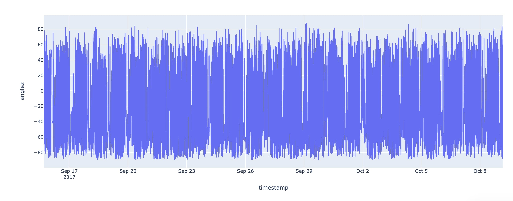

 # Sleep Detection using Wrist-Worn Accelerometer Data

## 1. Title and Author
- **Sleep Detection using Wrist-Worn Accelerometer Data**
- Prepared for UMBC Data Science Master Degree Capstone by Dr Chaojie (Jay) Wang
- Author Name : [Manikanta Panuganti]()
- [Github](https://github.com/mani-kantap)
- [Linkedin](https://www.linkedin.com/in/manikantap-dev/)
- [Presentation](https://github.com/DATA-606-2023-FALL-MONDAY/Panuganti_Manikanta/blob/main/data/Presentation.pdf)
- Link to your YouTube video 
    
## 2. Background

Sleep is undeniably crucial for both physical and mental well-being. It plays a fundamental role in maintaining overall health, impacting various facets of human life, including cognitive function, mood regulation, behavior, and emotional well-being. However, despite its paramount importance, conducting comprehensive and precise sleep research has been a persistent challenge. Polysomnography (PSG) stands as the gold standard for sleep measurement, providing highly accurate data. However, PSG is not without its drawbacks, as it is an expensive and time-consuming method, making it impractical for large-scale studies and routine monitoring.In contrast, wrist-worn accelerometers present a more accessible and cost-effective means of measuring sleep patterns. Nevertheless, the analysis of accelerometer data poses its own set of challenges, including the need for robust and accurate algorithms to extract meaningful sleep-related information.

The goal of this project is to develop a model to detect sleep onset and wake using wrist-worn accelerometer data. This will enable researchers to conduct more reliable, larger-scale sleep studies across a range of populations and contexts.

## 3. Data 

The data for this project was provided by the [Healthy Brain Network](https://healthybrainnetwork.org/). The data consists of wrist-worn accelerometer data which includes the following features:

- Data sources: https://healthybrainnetwork.org/, https://www.kaggle.com/competitions/child-mind-institute-detect-sleep-states/data
- Data size : 220 MB
- Data shape: 13165560 rows, 6 cols
- Each row is a continuous series recording of accelerometer data for a single subject spanning many days.

  
| Column Name | Data Type | Definition | Potential Values |
|-------------|-----------|------------|------------------------------------------------------------------------|
| series_id   | string    | Unique identifier for each accelerometer series. | 08db4255286f|
| step        | integer   | An integer timestep for each observation within a series. | 1|
| timestamp   | datetime  | A corresponding datetime with ISO 8601 format `%Y-%m-%dT%H:%M:%S%z`. |2018-11-05T10:00:05-0400 |
| anglez      | float     | As calculated and described by the GGIR package, z-angle is a metric derived from individual accelerometer components that is commonly used in sleep detection and refers to the angle of the arm relative to the vertical axis of the body. |-34.181801	 |
| enmo        | float     | As calculated and described by the GGIR package, ENMO is the Euclidean Norm Minus One of all accelerometer signals, with negative values rounded to zero. While no standard measure of acceleration exists in this space, this is one of the several commonly computed features. | 0.0443	|
| awake       | integer   | State of the sleep | 0 (awake) or 1 (asleep) |

- Target Label: Awake
- features/predictors: anglez, enmo

  ## 4. Exploratory Data Analysis (EDA)

The Exploratory Data Analysis is performed using Google Colab with a primary goal of understanding the data, summarizing key statistics, creating visualizations, identifying potential data cleansing requirements, and ensuring the resulting dataset is tidy.

**- Missing Value Analysis**
Checking for missing values is essential to ensure data quality and cleanliness.

As we can see in the image there are no null values for all the features, the data is good for analysis.

**- Visualizations using Plotly Express**
   
Visualizations are powerful tools for understanding the distribution and relationships within the data. Plotly Express is a Python library for creating interactive visualizations easily.

In this section, I have created histograms with box plots using Plotly Express. These visualizations help us understand the distribution of 'anglez' and 'enmo' for different sleep states.

**- Sleeping states anglez data**
This analyis is for sleeping states anglez value which is a feature coming from accelerometer.

over many days the data is distributed and anglez values is distributed between -80 to 80 value.

Below plot is of anglez for a single day.

as you can see when the person is sleeping the data variation is very low but when the person is sleeping there is too much variation in the anglez value.

**- Sleeping states enmo data**
Similar to anglez the values of enmo varies different based on the sleeping state

**- Featuere Engineering**
Based on the analysis for the sequence data, these are all the features have been added.

| Feature                  | Description                                                  | Type   | Calculation                                          |
|--------------------------|--------------------------------------------------------------|--------|------------------------------------------------------|
| Hour                     | Represents the hour of the day during data recording.        | Numeric| 0 to 23 (24-hour format)                              |
| Anglez Rolling Mean      | Rolling mean of anglez over a specified window.               | Numeric| Mean of anglez values within a rolling window         |
| Anglez Rolling Max       | Rolling maximum of anglez over a specified window.            | Numeric| Maximum value of anglez within a rolling window       |
| Anglez Rolling Std       | Rolling standard deviation of anglez over a specified window.| Numeric| Standard deviation of anglez values within a window  |
| Anglez Diff              | Difference between consecutive anglez values.                | Numeric| Difference between current and previous anglez values|
| Anglez Diff Rolling Mean | Rolling mean of anglez difference over a specified window.    | Numeric| Mean of anglez differences within a rolling window    |
| Anglez Diff Rolling Max  | Rolling maximum of anglez difference over a specified window.| Numeric| Maximum value of anglez differences within a window  |
| Enmo Rolling Mean        | Rolling mean of Enmo over a specified window.                | Numeric| Mean of Enmo values within a rolling window           |
| Enmo Rolling Max         | Rolling maximum of Enmo over a specified window.             | Numeric| Maximum value of Enmo within a rolling window         |
| Enmo Rolling Std         | Rolling standard deviation of Enmo over a specified window.  | Numeric| Standard deviation of Enmo values within a window    |
| Enmo Diff                | Difference between consecutive Enmo values.                 | Numeric| Difference between current and previous Enmo values   |
| Enmo Diff Rolling Mean   | Rolling mean of Enmo difference over a specified window.     | Numeric| Mean of Enmo differences within a rolling window     |
| Enmo Diff Rolling Max    | Rolling maximum of Enmo difference over a specified window.  | Numeric| Maximum value of Enmo differences within a window    |

## 5. Model Training 

### Models for Predictive Analytics
The following models have been chosen for predictive analytics:
* Logistic Regression
* Gaussian Naive Bayes
* Random Forest
* XG Boost

### Training 
- Train vs Test Split

The dataset has been split into training and testing sets to assess the model's performance on unseen data. I have used the common practice 80/20 split, where 80% of the data is used for training, and the remaining 20% is used for testing. Each selected model has been trained on the training dataset.

- Python Packages and Development Environment

The model training has been implemented on Google Colab and kaggle using Python packages, primarily scikit-learn for machine learning algorithms, numpy, pandas and pickle for saving and reloading the model.

All the models have performed well. Out of all the models XGBoost performed very well with high accuracy and ROC score so that model has been used for inference.

### Model Performance Comparison

| Model                 | Accuracy | ROC   |
|-----------------------|----------|-------|
| Logistic Regression   | 91       | 88    |
| Gaussian Naive Bayes  | 82       | 80    |
| Random Forest         | 96       | 96    |
| XG Boost              | 97       | 96    |

## 6. Application of the Trained Model

A Streamlit web app has been developed for the users to interact with which is deployed [here](https://sleepai.streamlit.app/) which is providing a seamless and intuitive experience for making predictions based on input data.

**Technology Stack**

The web application is built using Streamlit, a Python library that enables the creation of interactive web applications with minimal code. Streamlit is chosen for its simplicity and ease of integration with machine learning models.

**User Interface Design**

The user interface is designed to be user-friendly and intuitive. Users will be able to input relevant data through a simple form or interface, and the web app will provide predictions using the trained model. The design aims to make the application accessible to users with varying levels of technical expertise.

**Integration with Trained Models**

XGBoost and RandomForest models have been used in the final app. The model has been saved with Pickle format and the same format has been used to load and serve to the users.

## 7. Conclusion

This project serves as a basis for advancing the application of machine learning in sleep tracking and opens doors for further research to address existing challenges and uncover new insights into sleep analytics. Model training showcased the effectiveness of machine learning algorithms, with XG Boost achieving the highest accuracy of 97%. The development of the Streamlit web app extends the practical utility of these models to end-users, allowing them to make predictions based on their input data in a user-friendly environment.

The potential applications of this work are broad, ranging from personal sleep tracking applications to healthcare and wellness solutions. Individuals can benefit from personalized insights into their sleep patterns, while healthcare professionals may use the models for sleep disorder diagnostics and treatment planning.

### Limitations of the Work
Despite the promising results, there are certain limitations to this work. The accuracy achieved by the models may not generalize well to diverse datasets, and the performance may be sensitive to variations in data quality. Additionally, the models may not account for individual variations and complexities in sleep patterns, requiring further refinement for broader applicability.

### Future Research Directions
Future research can build upon this work by addressing its limitations and exploring additional avenues. Refinement of the models to handle diverse datasets and individual variations in sleep patterns is crucial. Integration of real-time data sources, such as wearable devices or continuous monitoring systems, can enhance the models' accuracy and applicability. Additionally, incorporating user feedback into the model training process can contribute to ongoing model improvement.

## 8. References 

[1] Fitness Trackers: How Actigraphy Detects Sleep-Wake Patterns. (n.d.). Verywell Health. https://www.verywellhealth.com/what-is-actigraphy-3015130

‌
[2] Lujan, M. R., Perez-Pozuelo, I., & Grandner, M. A. (2021). Past, Present, and Future of Multisensory Wearable Technology to Monitor Sleep and Circadian Rhythms. Frontiers in Digital Health, 3. https://doi.org/10.3389/fdgth.2021.721919
‌

[3] Chinoy, E. D., Cuellar, J. A., Huwa, K. E., Jameson, J. T., Watson, C. H., Bessman, S. C., Hirsch, D. A., Cooper, A. D., Drummond, S. P. A., & Markwald, R. R. (2020). Performance of seven consumer sleep-tracking devices compared with polysomnography. Sleep, 44(5). https://doi.org/10.1093/sleep/zsaa291
‌

[4] Delaney, L. J., Litton, E., Melehan, K. L., Huang, H.-C. . C., Lopez, V., & Van Haren, F. (2021). The feasibility and reliability of actigraphy to monitor sleep in intensive care patients: an observational study. Critical Care, 25(1). https://doi.org/10.1186/s13054-020-03447-8
‌

[5] Fekedulegn, D., Andrew, M. E., Shi, M., Violanti, J. M., Knox, S., & Innes, K. E. (2020). Actigraphy-Based Assessment of Sleep Parameters. Annals of Work Exposures and Health, 64(4), 350–367. https://doi.org/10.1093/annweh/wxaa007

